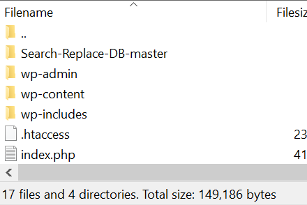

## Cellar Supply Work

[Site](https://www.cellarsupply.com)

### Invoices and packing slips

#### Goal: Eric wants packing slips and invoices that can be printed from the admin interface.

I found this plugin `WooCommerce PDF Invoices & Packing Slips`.

## Backup for updates

- Create a backup with Updraft Plus and put it in Dropbox (mgwood account)
- Run through the [AWS Bitnami WP] tutorial(https://aws.amazon.com/getting-started/tutorials/launch-a-wordpress-website/)
- On the fresh WP site install the UpdraftPlus Plugin and connect to the remote storage (Dropbox)
- Restore the site themes and plugins
- Restore the site database
- Now when you connect to the site you should be required to use the Cellar Supply login. It won't work unless Google ReCaptcha is diabled
- SSH into the new site to change the phpmyadmin settings so you can alter the database. You need to change `Require local` to `Require all granted`

```bash
cd Dropbox/Keys
chmod 400 cellar-supply-aws-key.pem
ssh -i "cellar-supply-aws-key.pem" ubuntu@ec2-18-212-101-172.compute-1.amazonaws.com
vim apps/phpmyadmin/conf/httpd-app.conf
```

You need to change `Require local` to `Require all granted` and then restart apache

```
<IfVersion >= 2.3>
Require all granted
</IfVersion>
```

```bash
sudo /opt/bitnami/ctlscript.sh restart apache
```

- Navigate to the phpmyadmin page by adding `phpmyadmin` to the end of the site url
- Use the `default Bitnami password` and `root` as the username
- In the WP Database (default is bitnami_wordpress) find the active plugins and disable google ReCaptcha [Reference](http://www.sokhawin.com/how-to-disable-your-wordpress-plugin-directly-in-database/)

```
SELECT * FROM `wp_options` WHERE  option_name = 'active_plugins';
```

```
a:28:{i:0;s:29:"gravityforms/gravityforms.php";i:1;s:23:"blox-lite/blox-lite.php";i:2;s:23:"digg-digg/digg-digg.php";i:3;s:37:"disable-comments/disable-comments.php";i:4;s:39:"easy-theme-and-plugin-upgrades/init.php";i:5;s:59:"genesis-connect-woocommerce/genesis-connect-woocommerce.php";i:6;s:30:"genesis-logo-uploader/logo.php";i:7;s:34:"genesis-simple-sidebars/plugin.php";i:8;s:43:"google-analytics-dashboard-for-wp/gadwp.php";i:9;s:33:"google-captcha/google-captcha.php";i:10;s:47:"gravity-forms-toolbar/gravity-forms-toolbar.php";i:11;s:39:"ignitewoo-updater/ignitewoo-updater.php";i:12;s:17:"legull/legull.php";i:13;s:45:"limit-login-attempts/limit-login-attempts.php";i:14;s:27:"quick-setup/quick-setup.php";i:15;s:51:"simple-maintenance-mode/simple-maintenance-mode.php";i:16;s:23:"soliloquy/soliloquy.php";i:17;s:25:"tablepress/tablepress.php";i:18;s:27:"updraftplus/updraftplus.php";i:19;s:53:"woocommerce-dropshippers/woocommerce-dropshippers.php";i:20;s:99:"woocommerce-gateway-paypal-powered-by-braintree/woocommerce-gateway-paypal-powered-by-braintree.php";i:21;s:79:"woocommerce-gateway-simplify-commerce/woocommerce-gateway-simplify-commerce.php";i:22;s:42:"woocommerce-menu-bar-cart/wp-menu-cart.php";i:23;s:80:"woocommerce-pdf-invoices-packing-slips/woocommerce-pdf-invoices-packingslips.php";i:24;s:51:"woocommerce-ups-drop-shipping/shipping-ups_rate.php";i:25;s:27:"woocommerce/woocommerce.php";i:26;s:41:"wordpress-importer/wordpress-importer.php";i:27;s:29:"wp-mail-smtp/wp_mail_smtp.php";}
```

Decrease the array counter by one, so `a:27:{...` here. Then delete the `i:9;s:33:"google-captcha/google-captcha.php";` from the array.

```
a:27:{i:0;s:29:"gravityforms/gravityforms.php";i:1;s:23:"blox-lite/blox-lite.php";i:2;s:23:"digg-digg/digg-digg.php";i:3;s:37:"disable-comments/disable-comments.php";i:4;s:39:"easy-theme-and-plugin-upgrades/init.php";i:5;s:59:"genesis-connect-woocommerce/genesis-connect-woocommerce.php";i:6;s:30:"genesis-logo-uploader/logo.php";i:7;s:34:"genesis-simple-sidebars/plugin.php";i:8;s:43:"google-analytics-dashboard-for-wp/gadwp.php";i:10;s:47:"gravity-forms-toolbar/gravity-forms-toolbar.php";i:11;s:39:"ignitewoo-updater/ignitewoo-updater.php";i:12;s:17:"legull/legull.php";i:13;s:45:"limit-login-attempts/limit-login-attempts.php";i:14;s:27:"quick-setup/quick-setup.php";i:15;s:51:"simple-maintenance-mode/simple-maintenance-mode.php";i:16;s:23:"soliloquy/soliloquy.php";i:17;s:25:"tablepress/tablepress.php";i:18;s:27:"updraftplus/updraftplus.php";i:19;s:53:"woocommerce-dropshippers/woocommerce-dropshippers.php";i:20;s:99:"woocommerce-gateway-paypal-powered-by-braintree/woocommerce-gateway-paypal-powered-by-braintree.php";i:21;s:79:"woocommerce-gateway-simplify-commerce/woocommerce-gateway-simplify-commerce.php";i:22;s:42:"woocommerce-menu-bar-cart/wp-menu-cart.php";i:23;s:80:"woocommerce-pdf-invoices-packing-slips/woocommerce-pdf-invoices-packingslips.php";i:24;s:51:"woocommerce-ups-drop-shipping/shipping-ups_rate.php";i:25;s:27:"woocommerce/woocommerce.php";i:26;s:41:"wordpress-importer/wordpress-importer.php";i:27;s:29:"wp-mail-smtp/wp_mail_smtp.php";}
```

- Now you should be able to login using the credentials from the old site.
- The theme, pages, and settings should all be the same. The only piece missing is the actual uploads and content of the site.
- To copy over the content, use FileZilla to connect via SFTP and copy all the site files over. The content files are under the wp-content folder. If you need to configure your FTP connection there is a configuration file you can download from the Go Daddy hosting cPanel. In FileZilla go File > Import and select the XML file downloaded from cPanel.
- If you are actually migrating the site, then you will want to also correct all of the messed up URLs in the database. Use the [Find and Replace Script from interconnectit](https://interconnectit.com/products/search-and-replace-for-wordpress-databases/) to search for old links and replace them with new links. The script has to be in a very specific web accessible folder next to /wp-admin and /wp-content /wp-includes. Unzip it and then transfer the files to the server using Filezilla.



I ran two replacements. I needed to replace all of the `https://www.cellarsupply.com` with `http://18.212.101.172`. Then `www.cellarsupply.com` with just `18.212.101.172`. I didn't bother to use the regex.


### Alternative to Filezilla wp-content transfers

Copy the current live site using rsync.

```
rsync -arvz --dry-run greatwmc@info.jmu.edu:/var/www/html/uinfo/wp-content/uploads/sites "/Volumes/OPTIMUS PRIME/web_backup_mar31_17/"
rsync -arvz --dry-run greatwmc@info-dev.jmu.edu:/var/www/html/uinfo/wp-content/uploads/sites "/Volumes/OPTIMUS PRIME/dev_web_backup_mar31_17/"
```

This is the dry-run command, obviously run it again without the dry-run option once you’re sure it is doing what you want.
