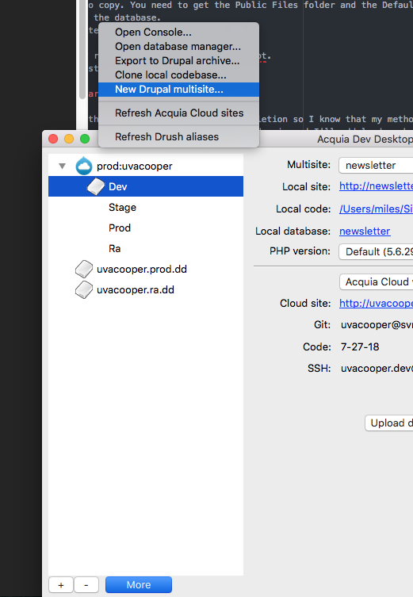
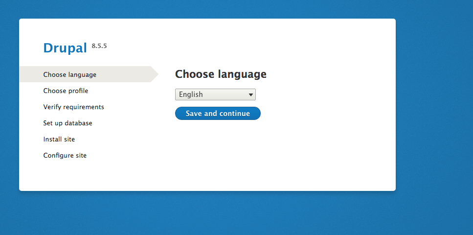

# Multisite installation
I want to easily duplicate the home site so that I can create the unit page sites and enjoy my family's vacation in 2 weeks. The moon is going to block out the fucking sun and I'm not gonna miss that little cheesy bastards big moment.

Use the auto creation tool for multisite on Acquia Dev Desktop. Make sure you use the correct names for the sites when you make them so that the dev site matches the live site except for the domain. The subdomains should all match. [Acquia Tutorial](https://docs.acquia.com/dev-desktop/multisite)

The Acquia documentation provides useful information but it is all handled by dev desktop so don't worry too much about it all. My goal is to use the Backup and Migrate module to effectively clone a site with Acquia handling all of the pesky environment issues.

# Multisite Site Creation - Step 1 Empty site

1. Create the new Multisite in Dev Desktop > More > New Drupal Multisite. 
2. Input the site name and select create new database. ceps in this case.
3. Go to the launched site locally and start the install.php process. 
4. Enter the Configure site info password, site name, email `coopercenter-webmaster@virginia.edu`,  time zone etc.
5. Include the new site URL for your dev environment in the sites php file like this `$sites['newsite.coopercenter.org'] = 'newsite';`
6. Make sure acqui cloud dev has your domain from the sites.php file declared in the dev environment too
5. Now that the site is live locally try to launch it to Acquia before more migration of files. Before launching it you shouldn't get the vanilla drupal site when you go to the site URL. (Note: the site  URL must be included in the sites.php file). Trying to push the database from Acquia Desktop Fails but it does add a much needed line to the end of the settings.php file.
6. Using terminal manually commit and push the changes made to the settings.php file onto the active branch on Acquia. You should make a new branch for this site creation and deploy it on acquia. So for ceps make a ceps branch and deploy it on Acquia.
7. With the settings.php file successfully committed and live on Acquia, the Dev Desktop push should work now. So go to the Dev environment site after a second attempt at using Dev Desktops push database and code to Acquia.
8. This time it works and you have a vanilla site on the Dev Environment.

[Drupal Documentation](https://www.drupal.org/docs/7/multisite-drupal/multi-site-sharing-the-same-code-base)

# Backup And Migrate Module - Step 2 Populating content

Now that we have our new empty site, we need to populate it. The easiest way to do this is with the Backup and Migrate tool.
1. Enable the backup tool on the new site. If it won't appear in Config > Development > Backup & Migrate , then uninstall and reinstall it
2. Clear the Cache of the site you want to copy. This reduces the database size drastically.
2. Make a backup of the site you want to copy. You need to get the Public Files folder and the Default Drupal Database. Save them locally and name them so you know which is files and which is the database.
3. Upload the files to the new empty site.
4. Upload the database to the new site.
5. Clear Cache in developer tools or by running `drush cr` in the docroot.
6. Start working on the new site you just successfully cloned

# Launching the new site after changes are made

Since this is a sprint. I want to take this process all the way to completion so I know that my method will work. I want to launch my copied site with a few extra pieces of content on my actual domain. moebot.audio is the domain and I'll add lead.moebot.audio to the start of the domain. I'm sure there is some piece of code I have to edit to ensure that Acquia actually navigates to the correct site.

You must edit the sites.php file so that it explains to drupal what folders are needed to properly display the site. Once those code changes are committed, then you need to make sure that Acquia is on the correct branch so that those code  changes actually show up. Go into the Acquia Evironment and switch the code to the correct branch.

## Troubleshooting guide

### On the install.php page I am told that the settings.php file is not writeable.

Editing the local version of the settings.php file and then manually pushing the branch to Acquia solved the problem. I din't change permissions on the file. I just pushed my newly created local branch for the site and switched it on Acquia to the new branch.

### Local File Permissions errors on manual multisite creation. DONT ATTEMPT MANUAL CREATION

For installing permission on sites/default should be 755 [drwxr-xr-x]:

`ls -l sites/`

`chmod 755 sites/default`

For the install permission on settings.php should be 644 [-rw-r--r--]:

`ls -l sites/default/settings.php`

`chmod 644 settings.php `

At all times files folder should be 755
Inside the files folder should be 775 if 755 isn't working

`chmod -R 755 sites/default/files`

I edited the crap out of the http.conf file for Apahce
/private/etc/apache2/http.conf
/private/etc/apache2

## After install you need to set settings to read only and default to read execute.

`chmod 555 sites/default`

`chmod 444 sites/default/settings.php`

I am having no success getting the install to work with the subdomain of http://sei.coopercenter.org:8083/install.php.
