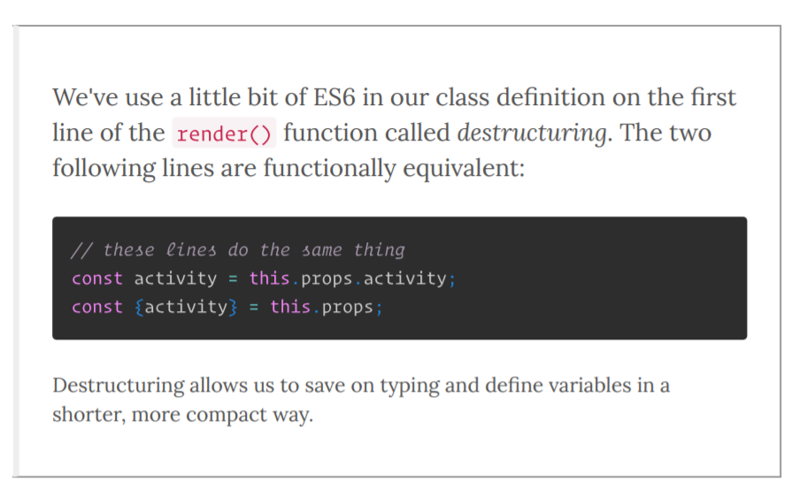

## Basic Tutorials

[React basics](https://reactjs.org/)
So react uses jsx (Javascript Syntax Extension) which looks like html with some key components.
- Class constructors which have a call to a super constructor, state, and event handlers
- render function that contains the html and sets the initial state, and assigns the event listeners like onChange={this.eventHandlerFunction}
- event handler functions that take in an event parameter and are attached to the class object
- a final ReactDom.render call to actually render the node

So questions I have from this example...
- What is in the super(props) constructor?
- what are the variables attached to an event object?
- why are we declaring some elements const like in the handleSubmit function with newItem? Is it creating a new object in memory that needs to exist past the end of the event handler function call?


```
class TodoApp extends React.Component {
  constructor(props) {
    super(props);
    this.state = { items: [], text: '' };
    this.handleChange = this.handleChange.bind(this);
    this.handleSubmit = this.handleSubmit.bind(this);
  }

  render() {
    return (
      <div>
        <h3>TODO</h3>
        <TodoList items={this.state.items} />
        <form onSubmit={this.handleSubmit}>
          <input
            onChange={this.handleChange}
            value={this.state.text}
          />
          <button>
            Add #{this.state.items.length + 1}
          </button>
        </form>
      </div>
    );
  }

  handleChange(e) {
    this.setState({ text: e.target.value });
  }

  handleSubmit(e) {
    e.preventDefault();
    if (!this.state.text.length) {
      return;
    }
    const newItem = {
      text: this.state.text,
      id: Date.now()
    };
    this.setState(prevState => ({
      items: prevState.items.concat(newItem),
      text: ''
    }));
  }
}

class TodoList extends React.Component {
  render() {
    return (
      <ul>
        {this.props.items.map(item => (
          <li key={item.id}>{item.text}</li>
        ))}
      </ul>
    );
  }
}

ReactDOM.render(<TodoApp />, mountNode);
```

## Goals

Make a single page web app using react that continuously plays moe. from archive.org.

1. Configure react properly with a basic template project
2. Figure out how to play mp3 files in a html page
3. Figure out how to get the mp3 files out of archive
4. Figure out how to stream the songs so you get continuous playback

### React Configuration

- You need node.js installed as well as npm so in linux shell install them.
- Then make sure the create-react-app command is installed globally
- Lastly create your react app
```
sudo apt install npm
npm install -g create-react-app
create-react-app moe
cd moe
npm start
```

Upate npm (node package manager) to the current version on laptop.

```
sudo npm install -g npm
```

Then update nod.js to the latest version [how to](https://www.hostingadvice.com/how-to/update-node-js-latest-version/)

```
node --version
v4.2.6
npm install npm@latest -g
```

[Basic React Tutorial and setup video](https://www.youtube.com/watch?v=A71aqufiNtQ)

## Installing react on linux subsystem on windows


Before update/install

node --version v4.2.6
nvm --version `command not found`
npm --version `error`

```
/usr/local/lib/node_modules/npm/bin/npm-cli.js:84
      let notifier = require('update-notifier')({pkg})
```

[Tutorial](https://gist.github.com/noygal/6b7b1796a92d70e24e35f94b53722219)

First update your system. Then use the curl script to install node version manager `nvm`. Verify that nvm is installed and then run `nvm install stable` to get the latest node version.

```
sudo apt-get update
sudo apt-get upgrade
sudo apt-get install build-essential
curl -o- https://raw.githubusercontent.com/creationix/nvm/v0.33.5/install.sh | bash

Close and reopen terminal
nvm --version
0.33.5

nvm install stable
```

node --version = `v12.6.0`
npm --version  = `v6.9.0`
nvm --version  = `v0.33.5`

Now we can create our app

```
npx create-react-app beheard-photos
```

### Playing MP# in a html document

[Audio tag docs](https://developer.mozilla.org/en-US/docs/Web/HTML/Element/audio)

So I want to get the data from archive to play a mp3 file. The pieces of data i want/need are in the archive examples.
```
<video controls autoplay name="media">
  <source src="https://archive.org/download/moe.2017-01-26/moe.2017-01-26d01t01.ogg" type="application/ogg">
</video>
```
I just need to get the show piece of the url and the song piece of the url. I already grabbed all of that from archive and put it into my own SQL database. Let's try to display it using react now.


## Trying out an example of dynamic audio Playing

[This audio player solved the dynamic audio playing problem](https://www.npmjs.com/package/react-audio-player)
[Other Example of getting audio to load](https://gist.github.com/jimthedev/7047c3258166fcfe83f2d47b835487ad)

# Getting react and java to play together

So I have this react front end working but I want it to work on m AWS instance where now all I have is the static html that's being served from my java servlets. I need the url moebot.audio to serve up the react front end that I made. Let's work on getting that to function properly. So I made the java app using netbeans. Let's download that and modify it so I can put it into elastic beanstalk with modified front end code.

## Netbeans Setup

 - Download Java SE and install it Windows 64 version
 - Install netbeans
 - Clone existing codebase of moebot web app `git clone https://github.com/milesgwood/moebot.audio`
 - In netbeans import the git repository (team > git > clone)

### Install Apache Tomcat EE server

[Install Apache Tomcat EE](https://www.youtube.com/watch?v=pKMgr8uNvGM) by downloading the latest tomcat server. I'm using the Tomcat 9 server in my Sites directory.

### Specify tomcat server in Netbeans

Go tools > servers> add server > select Apache Tomcat or TomEE > and then select the home folder of the Tomcat server you downloaded. Inside the home folder is the bin conf and lib folders. I should be the only folder that gets extracted from the download. Set the username and password to a default since this is a local server only. I used admin password for simplicity here. If you want to user better passwords follow [this tutorial](https://www.youtube.com/watch?v=psvuLBVeTzQ).

Finally, you need to apply the server to your project. Rt. click project > properties > Run and specify the apache tomcat server. Now your project should run.

## Copy basic react into project - imports don't work  vs. GitPages

This example html page will use react correctly. [Source](https://medium.com/@to_pe/how-to-add-react-to-a-simple-html-file-a11511c0235f)

```
<div id="root"></div>
    <script src="https://cdnjs.cloudflare.com/ajax/libs/react/15.4.2/react.js"></script>
    <script src="https://cdnjs.cloudflare.com/ajax/libs/react/15.4.2/react-dom.js"></script>
    <script src="https://cdnjs.cloudflare.com/ajax/libs/babel-standalone/6.21.1/babel.min.js"></script>
    <script type="text/babel">
    class Greeting extends React.Component {
        render() {
            return (<p>Hello world</p>);
        }
    }
    ReactDOM.render(
        <Greeting />,
        document.getElementById('root')
    );
    </script>
```  

This method doesn't work when there are imports.

## Launch create-react-app with GitPages

[Instructions](https://medium.freecodecamp.org/surge-vs-github-pages-deploying-a-create-react-app-project-c0ecbf317089)

```
npm run build

add homepage to package.JSON
"homepage": "https://<github-username>.github.io/<project-repo

npm install --save-dev gh-pages

add deploy to scripts in package.json
"deploy" : "npm run build&&gh-pages -d build"
npm run deploy
```

Setting the mode of the request to cors and the response header to "Access-Control-Allow-Origin", " * " made the request allowed from one domain to another. In Java Servlet for /justListen
```
response.addHeader("Access-Control-Allow-Origin", "*");
```

In the react app where we fetch the data
```
fetch(
      `http://moebot.audio/justListen`,
      {   method: 'GET',
          mode: 'cors',
       }
     )
```

## Updating Node


## 30 Days of React notes

- Pure react components don't have state and are faster.
- You can use ES6 syntax for props variables, but not props that are functions (i think)

```
// these lines do the same thing
const activity = this.props.activity;
const {activity} = this.props;
```



- Curly braces are used in `object syntax` - plain js

```
const myObject = {
  title: "Hello",
  id: 12345,
  children : ["steve", "hailey", "jon"]
}
```

- Curly braces are also used to `notate JSX template tags` which you can put plain js inside of

```
const App = (props) => {
  return (
    <ul>
      {a.map(i => {      <--- note the regular js map function is inside the JSX template tag
        return <li>{i}</li>
      })}
      </ul>
    )
}
```

- Constructors are for defining props and state
This constuctor sets props for 3 functions which require you to bind the functions to the prop variable. The assignment takes the function declaration from the containing class and attaches it to the prop variable (i think). For regular props you can use the ES6 curly braces syntax.

```
class App extends React.Component {
  constructor(props) {
    super(props);

    {/* Assigning Functions to props */}
    this.fetchCurrentTime = this.fetchCurrentTime.bind(this);
    this.handleFormSubmit = this.handleFormSubmit.bind(this);
    this.handleChange = this.handleChange.bind(this);

    {/* Assigning Variables to Props */}
    const activity = this.props.activity;
    const {activity} = this.props;

  {/* Setting state */}
    this.state = {
      currentTime: null, msg: 'now'
    }
}
```

## Photo Slider with react

To Do:
- Figure out how to update node and nvm
- Go through reading and highlight key learnings
- Add JSX syntax to atom editor
- Get atom to compile and show your notes while you edit
- Why do they use `const` declarations instead of var or let? When do you use each?
- Figure out how to get the compiled javascript from the JSX you create for adding to the site
- Implement Promises using BeheardCVA JSON API
- Create tests and test suite
- Do all the .js files need `import React from 'react'` at the top of the file?
- Can you use this syntax on classes and reuse components? The tutorial says it's for single use?

```
export class PhotoGrid extends React.Component {
}
export default PhotoGrid
```

I want to create a photo grid for BeHeardCVA using react. I'd like to explore css annimations and how to use react with JSON API on a drupal site.

[Dev Tips Loading Code](https://codepen.io/devtips/pen/zBgYmy/)

Using an old version of node cause I don't have time to update it in the airport. For reference `node v4.2.6`.

```
create-react-app photo-tiles
nvm start
```

Create your own sass file and start the sass watcher.

```
cd src
sass --watch .:.
```
