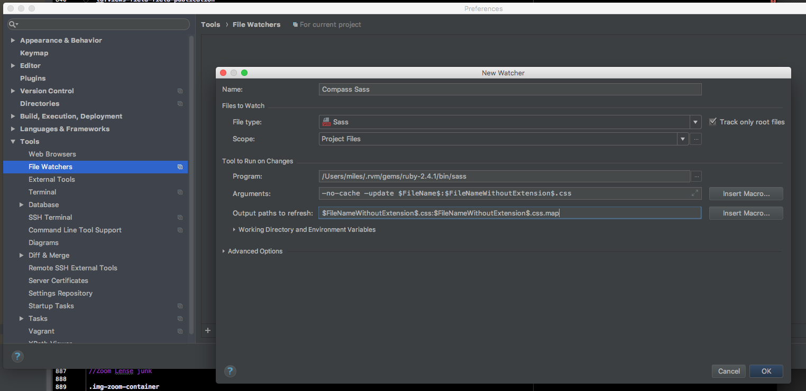

 ---
layout: default
---
#SASS phpFileStorm setup Sass


```
/Users/miles/.rvm/gems/ruby-2.4.1/bin/sass
--no-cache --update $FileName$:$FileNameWithoutExtension$.css
$FileNameWithoutExtension$.css:$FileNameWithoutExtension$.css.map
```



Sass is easier but having all of these preset css values is horrible.

I found a great trick for editing multiple lines at once in phpStorm.
The alt key adds a new cursor so you can type in two places at once.

Get rid of the .header margin
```css
#search-block-form > div > div , #edit-submit {
    margin-top: 10px;
}

#footer {
    background-color: #002654;
    color: #ffffff;
    position: absolute;
    right: 0;
    bottom: 0;
    left: 0;
    padding: 1rem;
    margin-bottom: 0;
}

*,
*:before,
*:after {
  box-sizing: inherit;
}

```

Here's a great codepen on [getting a footer to actually stick to the bottom of the page](https://codepen.io/cbracco/pen/zekgx). It recommends that you set the foother to absolute bottom and then add bottom padding to the parent element of the footer to equal height of the footer. Without that padding if the content reached the footer they would hide each other instead of pushing the footer lower. The height of the page needs to be at least 100% to push the footer off.


http://ceps.dd:8083/sites/ceps/files/default_images/3-2_0073_samuel-zeller-34751.png

## Flexbox

[Docs](https://developer.mozilla.org/en-US/docs/Web/CSS/CSS_Flexible_Box_Layout/Typical_Use_Cases_of_Flexbox)

### Properties of parent

display: flex
justify-content: space-between - puts space between all items

justify-content: center; - Centers it on primary axis
align-items: center; - Centers on y axis

align-items: flex-start -puts item at top  
align-items: flex-end  - puts item at bottom

flex-direction: column; - which direction do the items stretch - good for switching to mobile or cards
flex-direction: row-reverse; - for putting content in reverse order on main axis

### Properties of child

flex: auto - which means flex: 1 1 auto - which means all item grow and shrink at same rate.

```
C:/Ruby24/bin/sass.bat
$FileName$:$FileNameWithoutExtension$.css
$FileNameWithoutExtension$.css:$FileNameWithoutExtension$.css.map
```

3. Make sure that the ruby folder is added to the path. You can get to the windows path through start > Environment Variables


## SASS on cloud9

So sass is installed on the Cooper Center website livedev server. You can check with:

```
sass --version
1.11.0 compiled with dart2js 2.0.0
```

To start watching the sass files run:

```
cd /home/uvacooper/dev/livedev/docroot/themes/coopercenter_units/css
sass --watch .

or
sass --watch .:.

or
sass --watch .:output_dir/
```

[You can also lighten and darken colors with sass functions.](https://robots.thoughtbot.com/controlling-color-with-sass-color-functions)

```
background: lighten( $lt_grey,  5% )
background: lighten( $lt_grey,  10% )
```

# Animations

Tip for chrome. You can inspect animations in the devtools. It's next to the console.

# Border box

By default the box sizing is `content-box`.  That means that the width doesn't include the padding or border which is annoying. When you set something to be 200px you expect it to be 200px.

How do I set the box-sizing to border-box everywhere?

[source](https://w3bits.com/box-sizing-reset/)

```
html
  box-sizing: border-box

*,
*:before,
*:after
  box-sizing: inherit
```
