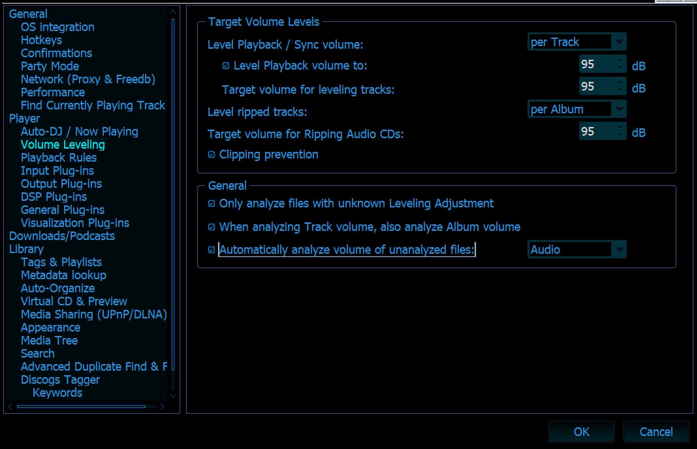

# TO DO

1. Condense Occasion and Comment Fields


# Adding New Music

Download the music to the `Dropbox/New Music` Folder
Move ready files to the `SendToMonkeyMedia` folder
On startup MM will auto organize those files.

If you then edit the tags then you need to:
1. Sync Tags - `Ctrl + s`
2. Auto Organize - `Ctrl - r`

# Finding Duplicates

In Library setting make sure that `Analyze for duplicates` is turned on. Then you can go to the Music > Files to Edit > Advanced Duplicate Search to find the duplicates and extract them.

Go through the duplicates dialogues. If you recently downloaded a lot then us the recent added auto playlist to delete duplicates in just that area.

## New Music Settings

DO NOT TURN ON VOLUME LEVELING!!! IT BREAKS SONGS!!!



This works by only updating a file if the files have a changed timestamp or size. So if you want to actually set the tags of a file you have to manually sync the files with the tags with the `ctrl + s` commnad.

If you...

 - Edited a song to cut out the crowd noise - just let Monkey Media rescan the file.
 - Just fixed the tags for a bunch of new files - select the files and save the changes with `ctrl+s`

 To avoid songs I fixed the tags for from getting bumped to the top of the library I deselected the `modify timestamp when updating tags` option. I may want to change that.

## Auto Organize Schema


Make sure these schema are set
Music Folder - `Artist\Album\Track#\Title`
TV Shows Folder - `Series\Season\Episode#-Title`

I may want to set MM to auto organize in scans or edits but I don't want it to delete the SendToMonkeyMedia Folder.

# Automatic level the volume


- Check the Automatically analyze the volume of unanalyzed

My hope is by changing this and increasing the typical decibels to 95 I'll get more volume on mobile.

This requires analyzing almost all of the tracks!

# General settings

Skin - Eclipse 3
Font size for lyric view - `Right click lyric view -> Choose Fields -> Text Size  20`

# Moving to new drive

[Wiki](https://www.mediamonkey.com/wiki/index.php/Moving_MM_to_a_new_computer)

1. Sync all tags (I ignored the videos) by selecting everything and `ctrl + s`
2. Backup the database in GitHub
```
Here are the default locations of these files:
MediaMonkey 4.x:

Windows 10 / 8.1 / 8 / 7 / Vista:
C:\Users\<USERNAME>\AppData\Roaming\MediaMonkey\MM.DB
C:\Users\<USERNAME>\AppData\Roaming\MediaMonkey\MediaMonkey.ini
C:\Users\<USERNAME>\AppData\Roaming\MediaMonkey\MetadataCache\
```
3. [Update location of files in database](http://www.mediamonkey.com/forum/viewtopic.php?f=2&t=63823)

Go to scripts and identify the base path for the old and new locations. I was moving from D:/Music to just M: so I entered those into the two boxes. The old path had an extra folder so I had to specify that. The new drive just has the drive letter.

4. Close the program and reopen it to save the changes.
